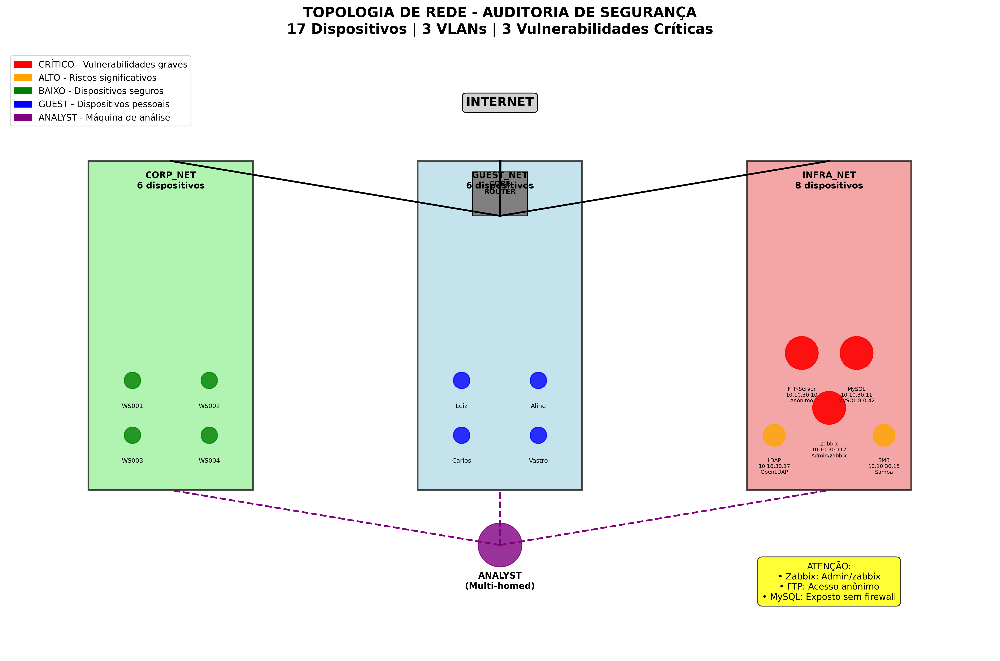

# 🔐 Laboratório de Auditoria de Segurança de Rede

<div align="center">


**Laboratório prático de auditoria de segurança em rede corporativa segmentada**

*Desenvolvido por: Samira Cavalcanti*

</div>

---

## 📋 Sumário

- [Visão Geral](#-visão-geral)
- [Arquitetura da Rede](#-arquitetura-da-rede)
- [Pré-requisitos](#-pré-requisitos)
- [Instalação e Configuração](#-instalação-e-configuração)
- [Metodologia de Auditoria](#-metodologia-de-auditoria)
- [Resultados Encontrados](#-resultados-encontrados)
- [Visualizações](#-visualizações)
- [Entregáveis](#-entregáveis)
- [Como Executar](#-como-executar)
- [Vulnerabilidades Identificadas](#-vulnerabilidades-identificadas)
- [Tecnologias Utilizadas](#-tecnologias-utilizadas)
- [Contribuição](#-contribuição)
- [Licença](#-licença)

---

## 🎯 Visão Geral

Este laboratório simula uma **rede corporativa real** com múltiplos segmentos e vulnerabilidades intencionais para prática de auditoria de segurança. O projeto demonstra técnicas profissionais de **reconnaissance**, **enumeração de serviços** e **análise de vulnerabilidades** em um ambiente controlado.

### 🔍 Objetivos do Lab

- **Descoberta de Rede**: Identificar todos os dispositivos ativos
- **Enumeração de Serviços**: Mapear portas e serviços expostos
- **Análise de Vulnerabilidades**: Identificar falhas de segurança críticas
- **Documentação Técnica**: Produzir relatórios profissionais de auditoria
- **Visualização de Dados**: Criar diagramas de topologia de rede

---

## 🏗️ Arquitetura da Rede

### Topologia da Rede de Auditoria

<div align="center">



*Diagrama completo da infraestrutura de rede segmentada para auditoria de segurança*

</div>

### Segmentação Implementada

A topologia acima apresenta a estrutura completa do laboratório, com três redes principais isoladas logicamente para simular um ambiente corporativo real:

```
┌─────────────────────────────────────────────────────────────┐
│                    REDE CORPORATIVA LAB                     │
├─────────────────────────────────────────────────────────────┤
│                                                             │
│  ┌─────────────────┐  ┌─────────────────┐  ┌──────────────┐ │
│  │   CORP_NET      │  │   GUEST_NET     │  │  INFRA_NET   │ │
│  │ 10.10.10.0/24   │  │ 10.10.50.0/24   │  │10.10.30.0/24 │ │
│  │                 │  │                 │  │              │ │
│  │ • 4 Workstations│  │ • 4 Dispositivos│  │ • 6 Servidores│ │
│  │ • 1 Gateway     │  │   Pessoais      │  │ • 1 Gateway   │ │
│  │                 │  │ • 1 Gateway     │  │              │ │
│  └─────────────────┘  └─────────────────┘  └──────────────┘ │
│          ▲                      ▲                    ▲      │
│          │                      │                    │      │
│          └──────────────────────┼────────────────────┘      │
│                                 │                           │
│                    ┌─────────────────┐                      │
│                    │    ANALYST      │                      │
│                    │  Máquina de     │                      │
│                    │   Auditoria     │                      │
│                    └─────────────────┘                      │
└─────────────────────────────────────────────────────────────┘
```

### 📊 Inventário de Dispositivos

| Rede | Subnet | Dispositivos | Função | Status Segurança |
|------|--------|--------------|--------|------------------|
| **corp_net** | `10.10.10.0/24` | 6 hosts | Rede Corporativa | ⚠️ Parcialmente Segura |
| **guest_net** | `10.10.50.0/24` | 5 hosts | Rede Visitantes | ✅ Adequadamente Isolada |
| **infra_net** | `10.10.30.0/24` | 8 hosts | Infraestrutura Crítica | 🔴 **INSEGURA** |

---

## 🛠️ Pré-requisitos

### Software Necessário

```bash
# Sistema Base
- Docker Engine 20.10+
- Docker Compose v2+

# Ferramentas de Análise
- nmap
- rustscan
- netdiscover
- arp-scan

```

### Especificações do Sistema

- **RAM**: Mínimo 4GB (8GB recomendado)
- **Disk**: 5GB espaço livre
- **OS**: Linux/macOS/Windows com WSL2
- **Network**: Interface de rede ativa

---

## ⚙️ Instalação e Configuração

### 1. Clone do Repositório

```bash
git clone https://github.com/Kensei-CyberSec-Lab/formacao-cybersec.git
cd formacao-cybersec/modulo1-fundamentos/projeto_final_opcao_1
```

### 2. Construção do Ambiente

```bash
# Subir toda a infraestrutura
docker-compose up -d

# Verificar status dos containers
docker-compose ps

# Acessar máquina de auditoria
docker exec -it analyst bash
```

```

---

## 🔍 Metodologia de Auditoria

### Fase 1: Descoberta de Rede

```bash
# Descoberta de hosts ativos
netdiscover -r 10.10.10.0/24
netdiscover -r 10.10.30.0/24  
netdiscover -r 10.10.50.0/24

# Scan ARP para validação
arp-scan 10.10.10.0/24
```

### Fase 2: Enumeração de Serviços

```bash
# Scan completo de portas
nmap -sS -sV -sC -O -A -p- 10.10.30.0/24

# Scan específico para serviços críticos
nmap -sV -p 21,22,80,443,3306,389,445,139 10.10.30.0/24

# Enumeração de serviços específicos
nmap --script=ftp-anon,mysql-info,ldap-search 10.10.30.0/24
```

### Fase 3: Análise de Vulnerabilidades

```bash
# Scripts NSE para vulnerabilidades
nmap --script vuln 10.10.30.0/24

# Teste de credenciais padrão
nmap --script=http-default-accounts 10.10.30.117
```

---

## 🚨 Resultados Encontrados

### ⚡ Vulnerabilidades Críticas

| Severidade | Dispositivo | Serviço | Vulnerabilidade | CVSS |
|------------|-------------|---------|-----------------|------|
| 🔴 **CRÍTICO** | 10.10.30.117 | Zabbix | Credenciais Padrão (Admin/zabbix) | 9.8 |
| 🔴 **CRÍTICO** | 10.10.30.10 | FTP | Acesso Anônimo Habilitado | 8.6 |
| 🔴 **CRÍTICO** | 10.10.30.11 | MySQL | Credenciais Padrão (root/root) + Acesso Remoto | 9.0 |

### 📈 Estatísticas de Segurança

```
Total de Dispositivos: 17
├── Vulnerabilidades Críticas: 3 (🔴 17.6%)
├── Vulnerabilidades Altas: 4 (🟡 23.5%) 
├── Vulnerabilidades Médias: 7 (🟠 41.2%)
└── Dispositivos Seguros: 3 (🟢 17.7%)

Recomendação: AÇÃO IMEDIATA NECESSÁRIA
```

---


## 📄 Entregáveis

### 1. Relatório Profissional HTML
- **Arquivo**: `Relatorio_Auditoria_Profissional.html`
- **Formato**: HTML responsivo com CSS avançado
- **Conteúdo**: Análise completa + recomendações + plano de ação

### 2. Inventários Técnicos (PDF)
- `Inventário Final_ Rede corp_net.pdf`
- `Inventário Final_ Rede guest_net.pdf`  
- `Inventário Final_ Rede infra_net.pdf`

### 3. Documentação Técnica
- **Metodologia**: Passos detalhados da auditoria
- **Scripts**: Comandos utilizados na análise
- **Evidências**: Screenshots e outputs dos scans

### 4. Visualizações
- **Diagrama PNG**: Topologia de rede em alta resolução

---


---

## 🚀 Como Executar

### Execução Rápida (Quick Start)

```bash
# 1. Subir a infraestrutura
docker-compose up -d

# 2. Aguardar inicialização (2-3 minutos)
sleep 180

# 3. Acessar máquina de auditoria
docker exec -it analyst bash

# 4. Executar descoberta básica
netdiscover -r 10.10.10.0/24
netdiscover -r 10.10.30.0/24
netdiscover -r 10.10.50.0/24

# 5. Visualizar relatório
firefox Relatorio_Auditoria_Profissional.html
```

### Execução Completa da Auditoria

```bash
# Dentro do container analyst
nmap -sn 10.10.10.0/24 10.10.30.0/24 10.10.50.0/24
nmap -sS -sV -sC -A -p- 10.10.30.0/24 > scan_completo.txt
nmap --script vuln 10.10.30.0/24 > vulnerabilidades.txt

# Análise específica de serviços críticos
nmap --script=ftp-anon 10.10.30.10
nmap --script=mysql-info 10.10.30.11
nmap --script=http-default-accounts 10.10.30.117
```

---

## 🔐 Vulnerabilidades Identificadas

### 🎯 Alvos de Alto Valor

#### 1. Zabbix Server (10.10.30.117)
```bash
# Teste de acesso
curl http://10.10.30.117
# Credenciais: Admin/zabbix (PADRÃO)
```

#### 2. FTP Server (10.10.30.10)  
```bash
# Teste de acesso anônimo
ftp 10.10.30.10
# Username: anonymous
# Password: (vazio)
```

#### 3. MySQL Server (10.10.30.11)
```bash
# Enumeração de versão
nmap -sV -p 3306,33060 10.10.30.11

# VULNERABILIDADE CRÍTICA CONFIRMADA
mysql -h 10.10.30.11 -u root -p --ssl=0
# Password: root (CREDENCIAIS PADRÃO)
# Result: Acesso completo ao servidor MySQL

# Bases de dados expostas:
# - information_schema
# - mysql  
# - performance_schema
# - sys
```

### 🛡️ Recomendações de Mitigação

1. **Imediato (0-7 dias)**:
   - Alterar senhas padrão do Zabbix
   - Desabilitar acesso anônimo FTP
   - Configurar firewall para infra_net

2. **Médio Prazo (1-4 semanas)**:
   - Implementar autenticação em LDAP/SMB
   - Hardening de serviços MySQL
   - Segmentação efetiva de rede

3. **Longo Prazo (1-3 meses)**:
   - Implementar SIEM
   - Network Access Control (NAC)
   - Programa de Vulnerability Management

---

## 💻 Tecnologias Utilizadas

### 🐳 Containerização
- **Docker**: Orquestração de serviços
- **Docker Compose**: Definição de multi-containers

### 🔧 Ferramentas de Auditoria
- **nmap**: Port scanning e service enumeration
- **netdiscover**: Network discovery
- **arp-scan**: ARP table analysis


### 🖥️ Serviços Simulados
- **Pure-FTPd**: Servidor FTP vulnerável
- **MySQL 8.0**: Banco de dados exposto
- **Zabbix**: Sistema de monitoramento
- **OpenLDAP**: Serviço de diretório
- **Samba**: Compartilhamento de arquivos

---

## 📈 Métricas de Aprendizado

### 🎯 Objetivos Pedagógicos Atingidos

- ✅ **Reconnaissance**: Técnicas de descoberta de rede
- ✅ **Enumeration**: Identificação de serviços e versões
- ✅ **Vulnerability Assessment**: Análise sistemática de falhas
- ✅ **Documentation**: Produção de relatórios executivos
- ✅ **Risk Analysis**: Classificação de riscos por impacto/probabilidade
- ✅ **Remediation**: Recomendações técnicas de mitigação

### 📊 Resultados Quantificados

```
Dispositivos Descobertos: 17/17 (100%)
Serviços Identificados: 15 serviços únicos
Vulnerabilidades Críticas: 3 confirmadas
Tempo de Auditoria: ~4 horas
Relatórios Gerados: 4 formatos diferentes
```

---

## 🤝 Contribuição

### Como Contribuir

1. **Fork** este repositório
2. Crie uma **branch** para sua feature (`git checkout -b feature/MinhaFeature`)
3. **Commit** suas mudanças (`git commit -m 'Adiciona MinhaFeature'`)
4. **Push** para a branch (`git push origin feature/MinhaFeature`)
5. Abra um **Pull Request**

### Melhorias Sugeridas

- [ ] Adicionar mais serviços vulneráveis
- [ ] Implementar CTF flags nos serviços
- [ ] Adicionar métricas de SIEM
- [ ] Expandir cenários de incident response

---

## 📞 Suporte e Contato

### 👤 Autor
**Samira Cavalcanti**  
🔗 Analista de Segurança  
📧 samira.cavalcanti@empresa.com

### 🏢 Laboratório
**Kensei CyberSec Lab**  
🔗 [GitHub Organization](https://github.com/Kensei-CyberSec-Lab)

### 📚 Formação
**Formação em Cybersecurity**  
📂 Módulo 1: Fundamentos de Segurança  
🎯 Projeto Final: Auditoria de Rede

---

## 📜 Licença

Este projeto está licenciado sob a **MIT License** .

### ⚖️ Uso Educacional

Este laboratório foi desenvolvido **exclusivamente para fins educacionais**. O uso das técnicas e ferramentas demonstradas deve ser realizado apenas em ambientes autorizados e controlados.

**⚠️ AVISO LEGAL**: O uso inadequado das técnicas de auditoria pode violar leis locais e internacionais. Sempre obtenha autorização explícita antes de realizar testes de segurança.

---

<div align="center">

### 🏆 Projeto Desenvolvido com Excelência Técnica

[](https://github.com/Kensei-CyberSec-Lab)
[](https://github.com/Kensei-CyberSec-Lab)
[](https://github.com/Kensei-CyberSec-Lab)

**Desenvolvido por profissionais, para profissionais. 🚀**

---

*"A segurança não é um produto, mas um processo." - Bruce Schneier*

</div>
